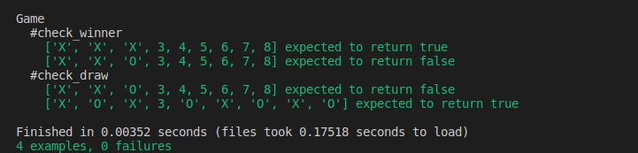

# RSpec test for the 'Tic-Tac-Toe' Game

> In this project, we were required to write RSpec for the Tic-Tac-Toe game.

# Project Specifications
For project specifications please refer to this link to Odin Project https://www.theodinproject.com/courses/ruby-programming/lessons/testing-your-ruby-code

# How to run the tests
- Download or clone the repository's files github repo
- Have Ruby 2.7 installed (to check if it is installed you can run: ruby -version in your console)
- Once repo is downloaded to local directory, in you console run cmd: rspec ./spec/game_spec.rb or rspec ./spec/player_spec.rb o

# Screenshot

## Built With

- Ruby1 (version <= 2.7.0p0)

## Live Demo

[Live Demo Link](https://repl.it/@GilbertGotora/ruby-tic-tac-toe)

## Authors

👤 Luciano Sarno

- Github: [@lucianosarno](https://github.com/lucianosarno)
- Linkedin: [@ls-soares](https://www.linkedin.com/in/ls-soares/)
- Twitter: [@Luciano68238988](https://twitter.com/Luciano68238988)

👤 Gilbert Gotora

- Github: [@ggotora](https://github.com/ggotora)
- Linkedin: [@gilbert_gotora/](https://www.linkedin.com/in/gilbert-gotora/)

## 🤝 Contributing

Contributions, issues, and feature requests are welcome!

Feel free to check the [issues page](issues/).

# Show your support

Give a ⭐️ if you like this project!

## Acknowledgments

- Microverse
- GitHub

## 📝 License

This project is open-licensed.

## 📝 Credits

This project was done by Luciano Sarno and Gilbert Gotora
