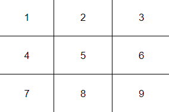
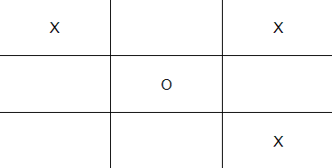
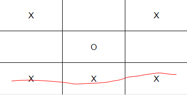
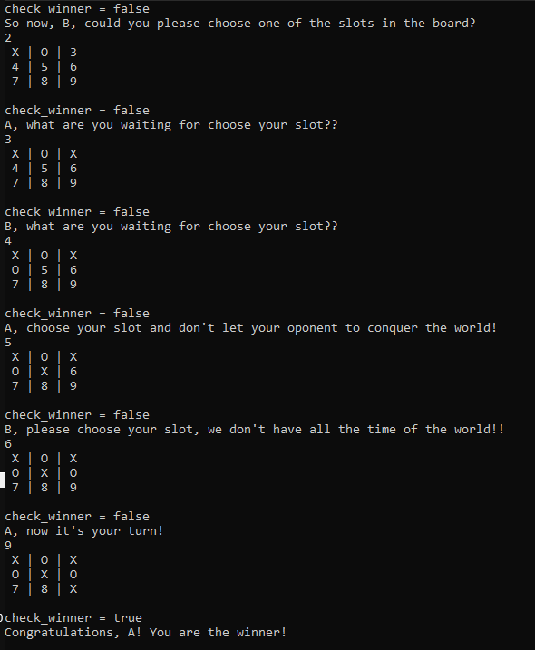

# Tic-Tac-Toe Game

> In this project, we were required to build a Tic-Tac-Toe game.

# Game Rules
This game rules are very simple:

- There is a board like the enumerated board above:

- Player1 is assigned to 'X' character
- Player2 is assigned to 'O' character
- Player1 and Player2 will turn plays
- Each play, the actual player can choose one of the 9 slots and fill with his/her character
- So, the board start to seems like this:

- Each slot can be selected only once
- The winner is the first player that 3 consecutive slots (aligned vertically, horizontally or diagonally, like the example above (where the player 'X' won due to the last horizontal line filled with 'X'):
 

# How to install
- Download or clone the repository's files github repo
- Have Ruby 2.7 installed (to check if it is installed you can run: ruby -version in your console)
- Once repo is downloaded to local directory, in you console run cmd: ruby bin/main.rb
- Enjoy the game!!

# Screenshot

## Built With

- Ruby

## Live Demo

[Live Demo Link]()

## Author

👤 Luciano Sarno

- Github: [@lucianosarno](https://github.com/lucianosarno)
- Linkedin: [@ls-soares](https://www.linkedin.com/in/ls-soares/)
- Twitter: [@Luciano68238988](https://twitter.com/Luciano68238988)

👤 Losalini Rokocakau

- Github: [@chelmerrox](https://github.com/AdesojiCodeMaster)
- Linkedin: [@losalini-rokocakau/](https://www.linkedin.com/in/losalini-rokocakau/)

## 🤝 Contributing

Contributions, issues, and feature requests are welcome!

Feel free to check the [issues page](issues/).

# Show your support

Give a ⭐️ if you like this project!

## Acknowledgments

- Microverse
- GitHub

## 📝 License

This project is open-licensed.

## 📝 Credits

This project was done by Luciano Sarno and Losaline Rokocakau
